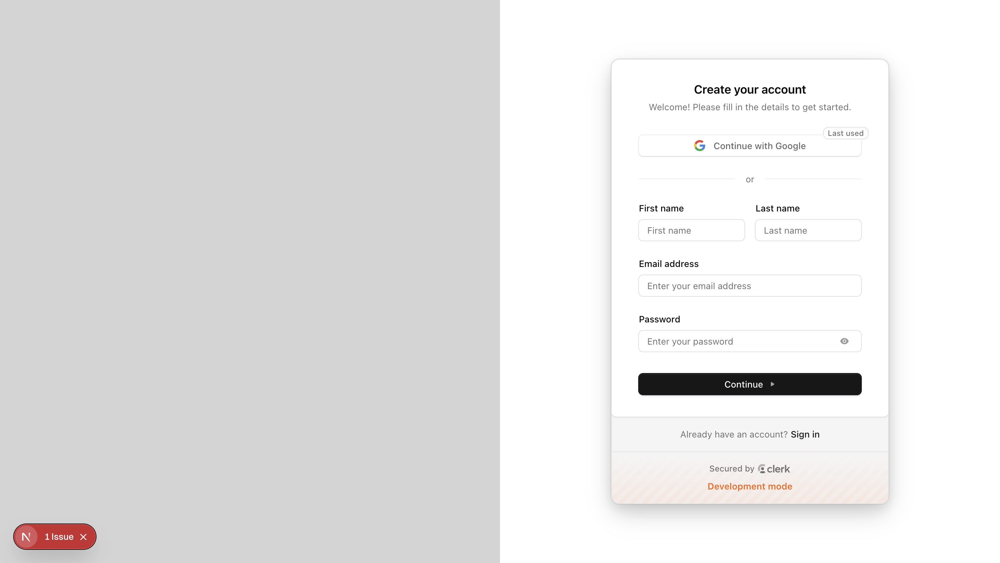
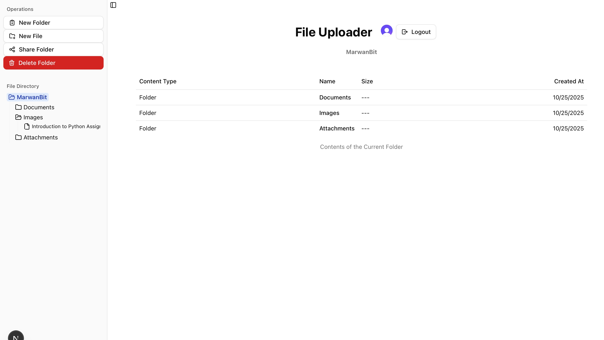
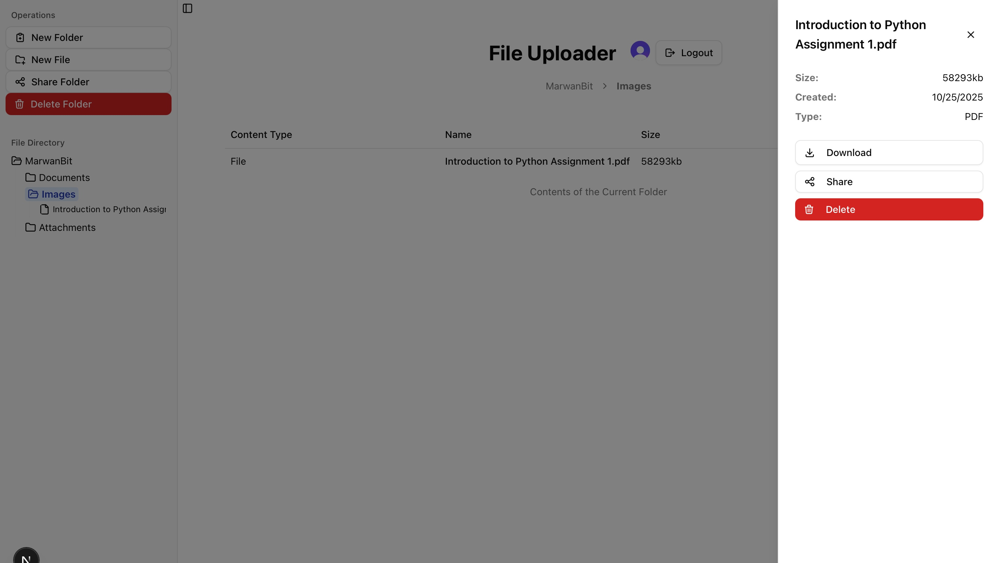
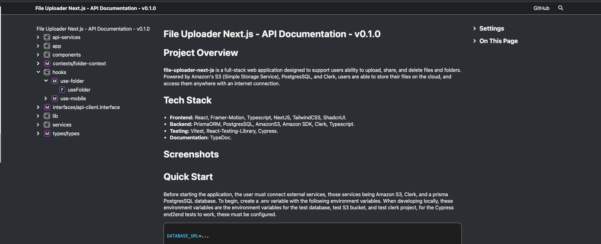
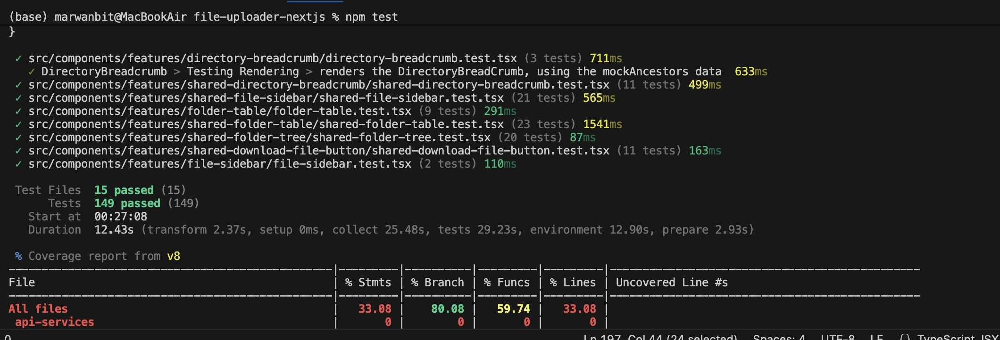
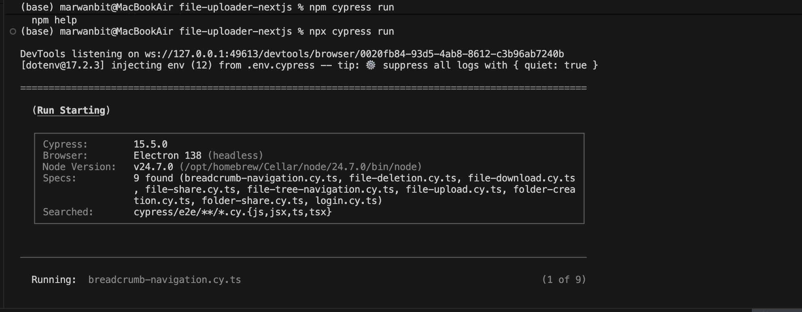
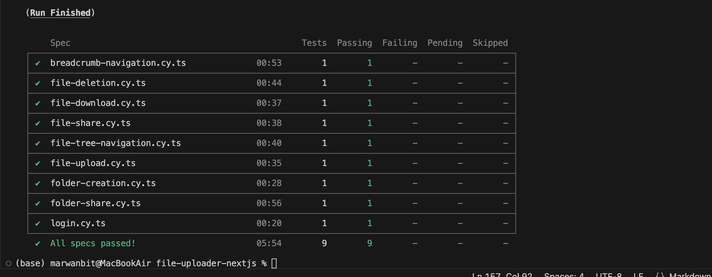

# Project Overview

**file-uploader-next-js** is a full-stack web application designed to support users ability to upload, share, and delete files and folders. Powered by **Amazon's S3** (Simple Storage Service), **PostgresSQL**, and **Clerk**, users are able to store their files on the cloud, and access them anywhere with an internet connection.

# Tech Stack

* **Frontend:** React, Framer-Motion, Typescript, NextJS, TailwindCSS, ShadcnUI.
* **Backend:** PrismaORM, PostgresSQL, AmazonS3, Amazon SDK, Clerk, Typescript.
* **Testing:** Vitest, React-Testing-Library, Cypress.
* **Documentation:** TypeDoc.

# Screenshots







# Quick Start

Before starting the application, the user must connect external services, those services being Amazon S3, Clerk, and a prisma PostgresSQL database. To begin, create a .env variable with the following environment variables. When developing locally, these environment variables are the environment variables for the test database, test S3 bucket, and test clerk project, for the Cypress end2end tests to work, these must be configured.

```
//.env
DATABASE_URL=...

# AWS File Storage Configuration
AWS_ACCESS_KEY_ID=...
AWS_SECRET_ACCESS_KEY=...
AWS_REGION=...
APPLICATION_BUCKET_NAME=...

# General Application Configuration
PORT=3000

# Clerk stuff
NEXT_PUBLIC_CLERK_PUBLISHABLE_KEY=...
CLERK_SECRET_KEY=...
NEXT_PUBLIC_CLERK_AFTER_SIGN_IN_URL=/folders
NEXT_PUBLIC_CLERK_AFTER_SIGN_UP_URL=/folders
NEXT_PUBLIC_API_URL=/api

CYPRESS_BASE_URL='http://localhost:3000'
```

Additionally in the root directory, make sure to create a seperate .env.cypress file containing the same environment variables, to ensure that Cypress can load them.

```
//.env.cypress
DATABASE_URL=...

# AWS File Storage Configuration
AWS_ACCESS_KEY_ID=...
AWS_SECRET_ACCESS_KEY=...
AWS_REGION=...
APPLICATION_BUCKET_NAME=...

# General Application Configuration
PORT=3000

# Clerk stuff
NEXT_PUBLIC_CLERK_PUBLISHABLE_KEY=...
CLERK_SECRET_KEY=...
NEXT_PUBLIC_CLERK_AFTER_SIGN_IN_URL=/folders
NEXT_PUBLIC_CLERK_AFTER_SIGN_UP_URL=/folders
NEXT_PUBLIC_API_URL=/api

CYPRESS_BASE_URL='http://localhost:3000'
```

For more detailed instructions on how to setup the various services, checkout the **Development.MD and Deployment.MD** files.

# Documentation Links

#### Code Documentation

For more detailed documentation on particular components or functions, this project utilizes TypeDoc to automatically generate documentation. In order to generate and serve this documentation, please execute the following commands in a terminal located at the root directory.

```bash
npm install
npm run docs:clean
npm run docs
npm run docs:open
```

The first command installs the necessary packages which the project utilizes, while the remaining commands clean, generate, and serve the documents respectively. After running each of these commands, the user should be able to see a tab open in their default browser, showing the generated documentation.



#### Design Documentation

For documentation about the design decisions, architecture of the project, database schema, deployment, and development, checkout the **API.md, ARCHITECTURE.md, DATABASE.md, DEPLOYMENT.md, and DEVELOPMENT.md** files in the /docs directory.

# Testing

#### Unit and Integration Testing with ViTest

Individual UI components are unit testing using vitest, in order to run these unit tests, run the following command in the terminal located at the root directory.

```bash
npm install
npm test
```

After running this command, you should see the following output in your terminal.



As apart of the output, the user gets a detailed breakdown of which tests pass/fail, alongside a table showing code coverage. Notice that coverage is low, but this is because other functionality is tested in the end2end testing suite.

### End2End Testing using Cypress

To run the tests first make sure that all your environment variables are set as described in the quick start section. Then run the following commands in a terminal located at the root directory.

```bash
npx prisma generate
npx prisma migrate deploy
npm run dev
```

The first two commands sync the database schema with the schema described in the schema.prisma file. This will spin up an instance of the application running locally on port 3000. Now in a seperate terminal, run the following commands to start Cypress's test runner.

```bash
npx cypress run
```

A succesful run of the testing suite should result in the following output in the terminal.





If configured correctly, you should see the tests running, with output to the terminal. For a more interactive visualization of the test runner, run the command `npx cypress open` to open Cypress's interactive test runner. As apart of the github repositories actions, on merging to the main branch all unit and e2e tests are run, in order to ensure that a new feature does not break functionality.

# Deployment

Deployment is done using Vercel, for details on how to deploy the project to vercel, checkout the **DEPLOYMENT.md** file in the **/docs** directory.
