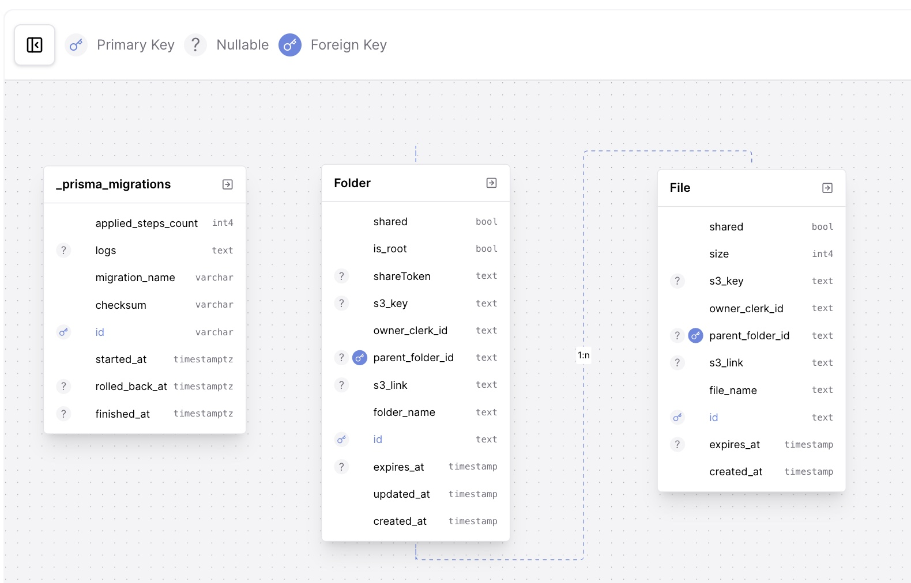

# Database Design

The application utilizes PrismaORM as an Object Relational Mapper to abstract away and handle complex database queries. The application relies on two main objects/ models stored in two seperate tables: **Folders**, and **Files**. Attached below is a diagram showing the Database Schema.



Above you can see a visualization of the three tables in the database, alongside their columns and relationships to each other. As you can see the Folders have a one-to-many relationship to the files, given by the parent_folder_id foreign key, where a file's parent_folder_id indicates it's parent_folder, and each folder has a corresponding files relation which maps to it's child files. We describe the models and their relationships in more depth below.

# Design Decisions

The purpose of the given database design is to naturally model the hierarchical nature of a file tree. Each Folder is treated as a node that contains a list of subnodes: files which are leaf nodes, and folders which are other nodes. The decision to model the Folder schema in this way allows us to easily display files within folders, without having the difficulty of parsing whether a node is a file or folder, hence why we have decided to have seperate **subfolders** and **files** properties in the folder model, instead of having a simple property called **children**.

We chose to have a unique root folder for each given clerk user, which is why the is_root, and owner_clerk_id fields are given in the Folder model, as it allows for quick retrieval of the root folder for each user, allowing us to display it on the /folders directory.

# Database Schema

```PSL
model Folder {
  id               String    @id @default(uuid())
  folder_name      String
  created_at       DateTime  @default(now())
  updated_at       DateTime  @updatedAt
  is_root          Boolean   @default(false)
  s3_link          String?
  shared           Boolean   @default(false)
  expires_at       DateTime?
  parent_folder_id String?
  owner_clerk_id   String
  s3_key           String?
  shareToken       String?   @unique
  files            File[]    @relation("FilesToFolder")
  parent_folder    Folder?   @relation("FolderToParentFolder", fields: [parent_folder_id], references: [id])
  subfolders       Folder[]  @relation("FolderToParentFolder")
}

model File {
  id               String    @id @default(uuid())
  file_name        String
  size             Int
  created_at       DateTime  @default(now())
  shared           Boolean   @default(false)
  s3_link          String?
  expires_at       DateTime?
  parent_folder_id String?
  owner_clerk_id   String
  s3_key           String?
  parent_folder    Folder?   @relation("FilesToFolder", fields: [parent_folder_id], references: [id])
}
```

# Folder

Below we will give a brief description of each property of the folder model.

* **id:** A unique uuid used to uniquely identify each folder.
* **folder_name:** The name of the folder.
* **created_at:** A Datetime indicating the time of creation of the folder.
* **updated_at:** A Datetime indicating the time of most recent folder update.
* **is_root:** A boolean indicating whether the folder is a root folder or not (root folder for the user which is unique).
* **s3_link:** A Link to the corresponding folder object in Amazon S3 (used for folder retrieval).
* **shared:** A boolean indicating whether the folder is shared or not.
* **expires_at:** A Datetime indicating the time that the folder share expires.
* **parent_folder_id:** A unique uuid indicating the id of the parent folder to this folder (used for navigation).
* **owner_clerk_id:** The uuid of the clerk user who own's this folder.
* **s3_key:** The S3 Key of the corresponding object in Amazon S3.
* **shareToken:** A unique string used as a passcode to access the file through a shared view if it has been shared.
* **files:** An array of file objects that are direct children of the current folder, constructed from the one-to-many relationship given by parent_folder_id in the file table.
* **parent_folder:** The folder object of the parent folder for the given folder.
* **subfolders:** An array of folder objects that are direct children of the current folder, constructed from the one-to-many relationship given by parent_folder_id in the folder table.


# File

Below we will give a brief description of each property of the file model.

* **id:** A unique uuid used to uniquely identify each file.
* **file_name:** The name of the file.
* **size:** The size of the file in kilobytes (kb).
* **created_at:** A Datetime indicating the time of creation of the file.
* **shared:** A boolean indicating whether the file is shared or not.
* **s3_link:** A Link to the corresponding file object in Amazon S3 (used for folder retrieval).
* **expires_at:** A Datetime indicating the time that the file share expires.
* **parent_folder_id:** A unique uuid indicating the id of the parent folder to this file (used for navigation).
* **owner_clerk_id:** The uuid of the clerk user who own's this file.
* **s3_key:** The S3 Key of the corresponding object in Amazon S3.
* **parent_folder:** The folder object of the parent folder for the given file.

# Additional Contraints

Additionally, in order to make sure that each user has a unique root folder, we have added the following unique partial index to the Folder table.

```SQL
-- This is an empty migration.
CREATE UNIQUE INDEX unique_root_folder_per_user
ON "Folder" (owner_clerk_id)
WHERE is_root = true;
```

Notice that this constraint ensures that each root folder is unique per clerk user, thus ensuring all user files and folders are stored under the automatically generated root_folder.