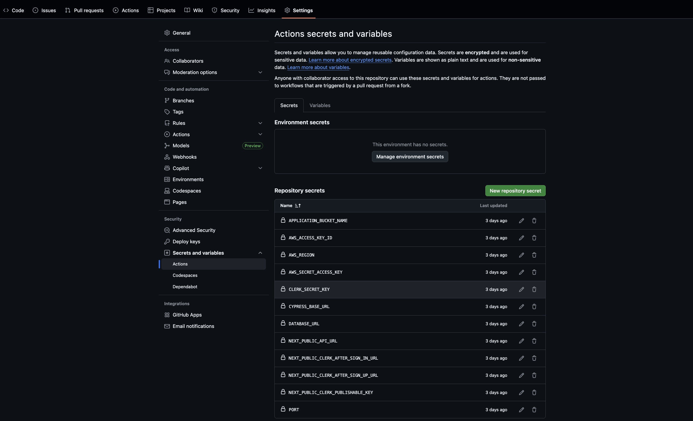
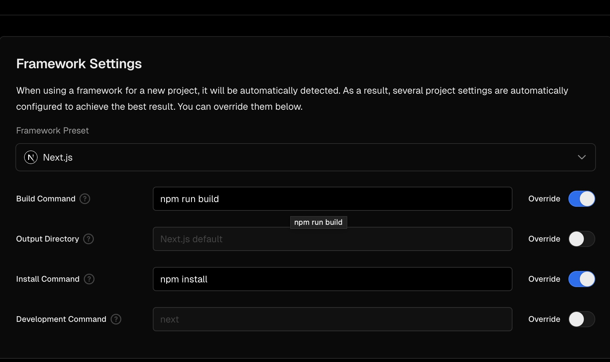
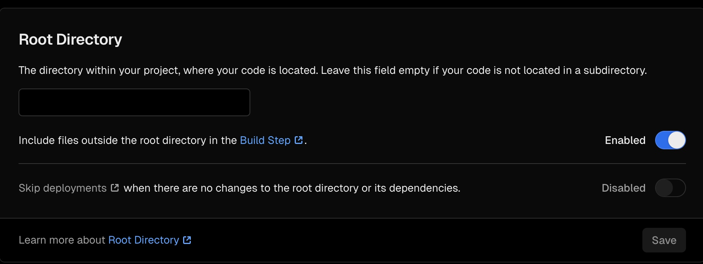
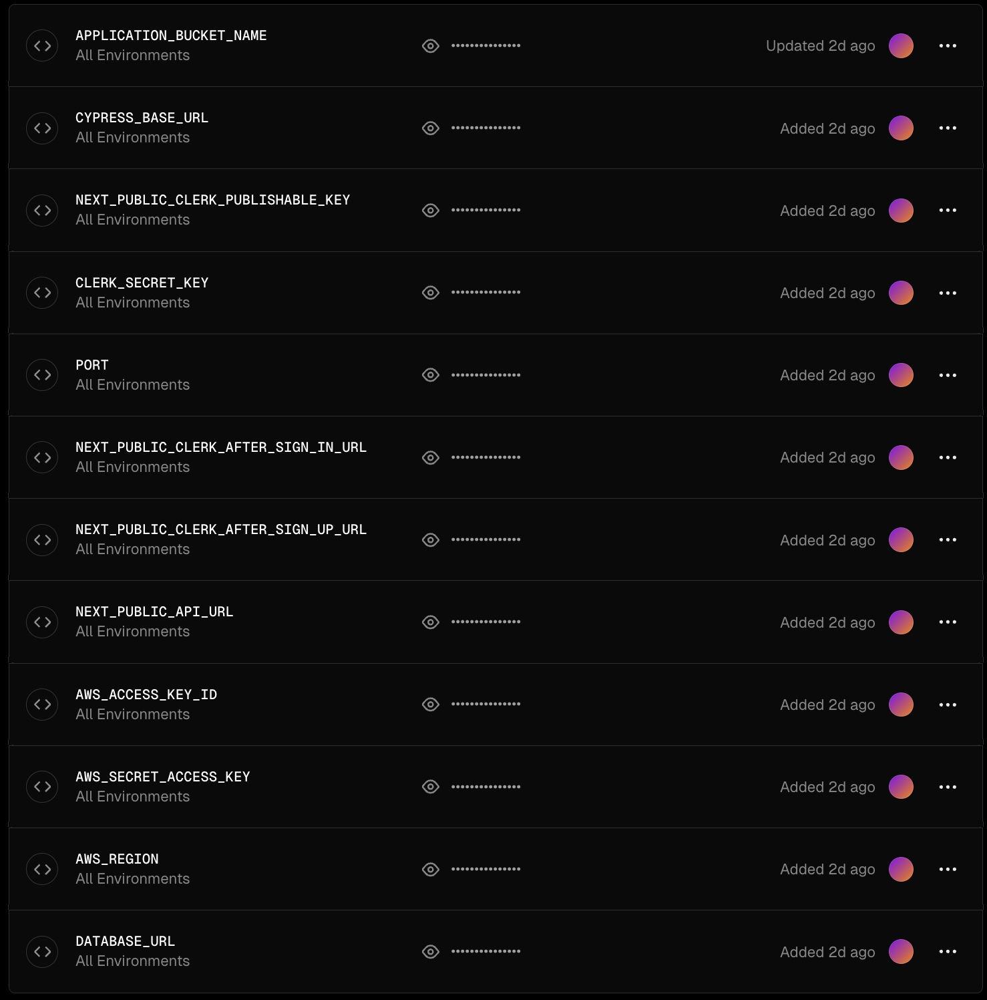

# Setting up Continuous Integration using Github Actions

This project utilizes Github Actions to perform Continous Integration (CI) upon pushing to and merging onto the main (protected) branch. In order to enable automatic testing upon pushing, the user must set secrets in their GitHub Respository.

The user must set the repositories "secrets" as described in the Quick Start section of the project, make sure to use the APPLICATION_BUCKET_NAME, AWS_ACCESS_KEY_ID, AWS_REGION, CLERK_SECRET_KEY, etc. of your test S3, test Clerk, and test Databases, as the testing suite using Cypress cleans ups the database, clerk, and S3 buckets before and after each test for isolated state per each test.

Once a push has passed the testing suite, merges and pull requests will be accepted to the main branch, which will then automatically deploy using Vercel.

# Setting up Continuous Deployment using Vercel

The project utilizes Vercel for seamless Continuous Deployment (CD) from the Github Repository. In order to deploy to Vercel, follow Vercel's deployment instructions linked below, alongside setting the following environment variables and build instructions. Additionally, their are some settings which need to configure in Vercel.

[Deploying From a GitHub Repository using Vercel](https://vercel.com/docs/git#deploying-a-git-repository)

Below lists the build command and install command required for deployment, additionally we will allow access from the root directory which the project is hosted from, make sure that the Framework Preset is Next.js.

Finally, we must configure Vercel to utilize the production S3 Bucket, production Clerk account, and production PostgresSQL database. Make sure to configure the environment variables just as described in the Quick Start section in README.md, making sure to replace all test environment variables, with the corresponding production environment variables.

